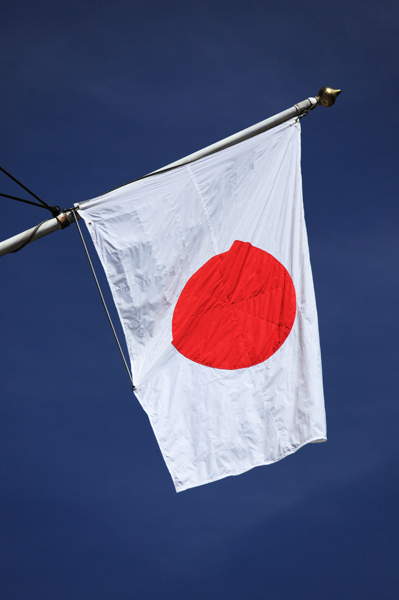

<a href="/" target="_blank"><h1>Games are made of Frames</h1></a>

---

# Frames per second

<table>
  <tr>
    <td rowspan="2"></td>
    <td>FPS = 10</td>
  </tr>
  <tr><td>Δt = 0.1s</td></tr>
  <tr>
    <td rowspan="2"></td>
    <td>FPS = 20</td>
  </tr>
  <tr><td>Δt = 0.05s</td></tr>
</table>

---

<a href="/" target="_blank"><h1>How to draw a frame?</h1></a>

---

# Using a Canvas

- HTML5 `<canvas>` element

- OpenGL Canvas

- Images

---

# Canvas in J2ME

- LCDUI canvas

- GameCanvas

---

<a href="/" target="_blank"><h1>Red ball on white Canvas</h1></a>

---

# Real Example

_from the Land of the Rising Sun_

---

# Code Example

---

# Recap

(Stuff we did on GameCanvas, step by step)

---

<a href="/" target="_blank"><h1>The End</h1></a>

_💟 Thanks for giving your time!_
