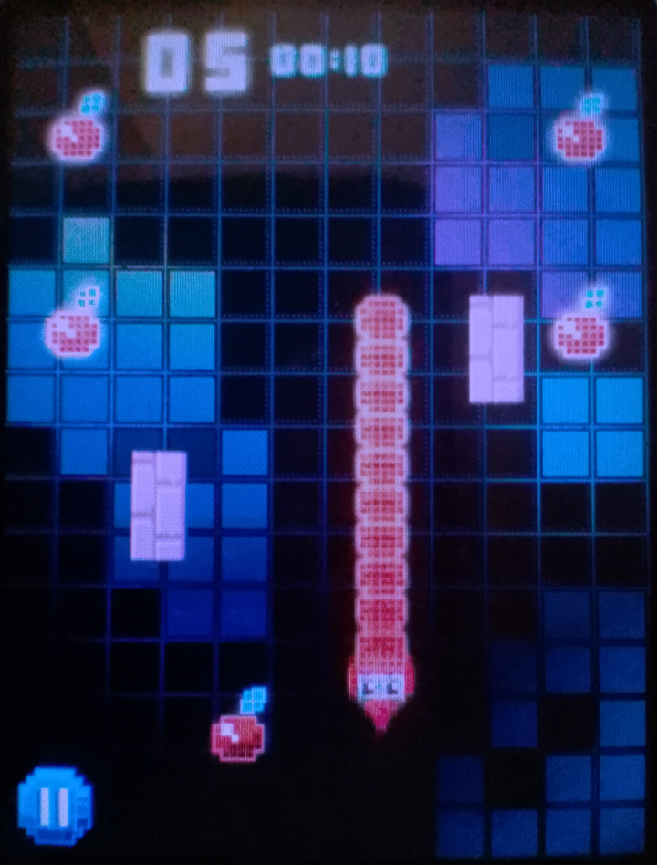
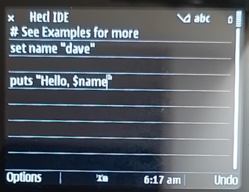
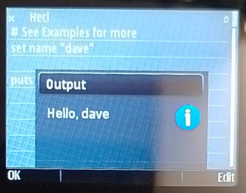

<a href="/" target="_blank"><h1>What even is J2ME?</h1></a>

---

# Java 2 Platform - Micro Edition

- features <a href="https://en.wikipedia.org/wiki/Java_Platform,_Micro_Edition#Main_extensions" target="_blank">🍴</a>

- gallery <a href="https://duckduckgo.com/?q=j2me+screenshots&iar=images" target="_blank">📸</a>

---

<a href="/" target="_blank"><h1>Why use J2ME?</h1></a>

---

# "Nostalgia"

_Physical force that pulls an object into ~~black holes~~ rabbit holes._

---

# Recycling

- _to repurpose e-waste is kindness_

- seek guidance <a href="https://lpcwiki.miraheze.org/wiki/Developing_for_old_phones" target="_blank">♻️</a>

- good ol' java <a href="https://www.oracle.com/java/technologies/javame-embedded/javame-embedded-documentation.html" target="_blank">☕</a>

---

# Offline tooling

- password vault <a href="https://www.bouncycastle.org/download/bouncy-castle-java/#latest" target="_blank">🔒</a>
- totp, 2fa, etc <a href="https://github.com/baumschubser/hotpants?tab=readme-ov-file#hotpants" target="_blank">🎲</a>
- special uses <a href="https://duckduckgo.com/?q=android+measurement+apps&iar=images" target="_blank">📐</a>

---

# Pixel art gaming

- Snake <a href="https://youtu.be/LNk2WVM7p9w" target="_blank">🐍</a>
- Spore Origins <a href="https://en.wikipedia.org/wiki/Spore_Origins" target="_blank">🦠</a>
- Assassin's Creed <a href="https://www.mobygames.com/game/32859/assassins-creed/screenshots/j2me/" target="_blank">🧕</a>
- _has official 2D game apis_ <a href="https://nikita36078.github.io/J2ME_Docs/docs/midp-2.0/javax/microedition/lcdui/game/package-summary.html" target="_blank">🛠️</a>

---

<a href="/" target="_blank"><h1>Where is J2ME?</h1></a>

---

# Supported platforms

- Nokia (S60, S30+), Sony Ericsson (A100, A200), etc.
- _a bunch of old cellphones_ <a href="https://lpcwiki.miraheze.org/wiki/Java_ME#Good_phones_for_running_Java_apps" target="_blank">🧶</a>
- Android phones with <a href="https://github.com/nikita36078/J2ME-Loader?tab=readme-ov-file#j2me-loader" target="_blank">J2ME Loader</a>
- <a href="https://sourceforge.net/projects/microemulator/" target="_blank">MicroEmulator</a> on PC
- _here be dragons!_ <a href="https://www.oracle.com/java/technologies/javame-embedded/javame-embedded-documentation.html" target="_blank">🐉</a>

---

<a href="/" target="_blank"><h1>How to code for J2ME?</h1></a>

---

# Development environment

- NetBeans project setup (GUI) <a href="https://docs.oracle.com/javame/8.3/sdk-dev-guide/setting-development-environment.htm#MESDD112" target="_blank">🫘</a>
- Gradle project setup (CLI) <a href="https://github.com/praj-foss/3310-eternum" target="_blank">🐚</a>
- API documentation <a href="https://nikita36078.github.io/J2ME_Docs/" target="_blank">📖</a>

---

# Scripting environment

- _J2ME programming inside J2ME!_
- Hecl programming language
- Code examples <a href="https://www.hecl.org/examples/" target="_blank">🚀</a>
- Download JAR app <a href="https://www.hecl.org/jars/cldc1.1-midp2.0/Hecl.jar" target="_blank">🍯</a>

---

---

<a href="/" target="_blank"><h1>The End</h1></a>

_💟 Thanks for giving your time!_
