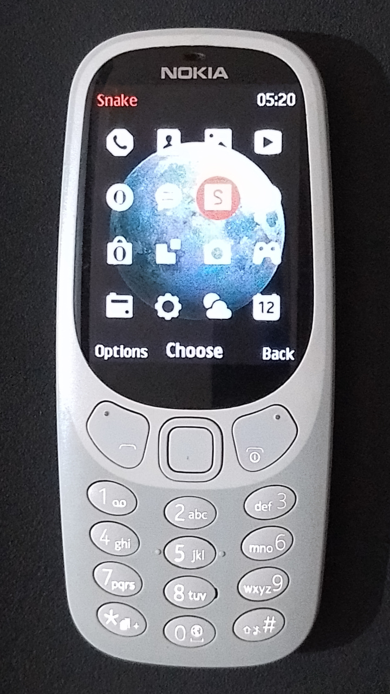
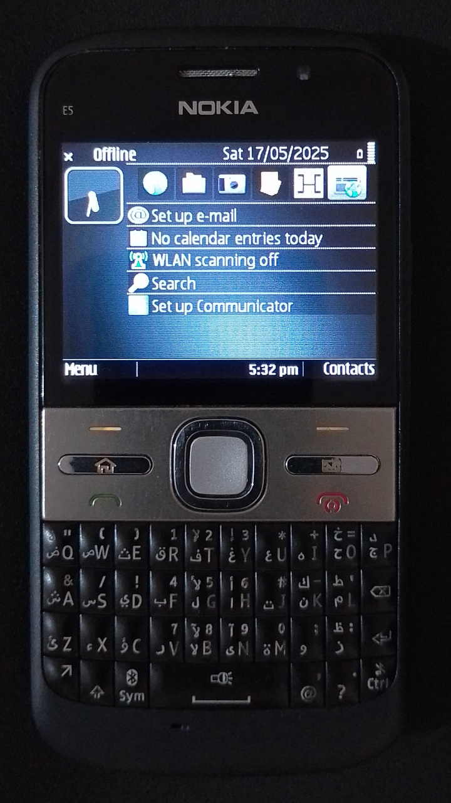

<a href="https://youtu.be/ZJR7FD7NohE?t=13s" target="_blank"><h1>Requirements and Setup</h1></a>

---

# Good to have

- High-school maths

- Java programming basics

- Device with J2ME support

- Love for video games <a href="https://en.wikipedia.org/wiki/History_of_video_games" target="_blank">❣️</a>

---

# 💥 The Boys

<a href="https://lpcwiki.miraheze.org/wiki/Nokia_3310_(2017)" target="_blank"><h3>Nokia 3310 2G</h3></a>

- Released 2017
- 260MHz ARM7 CPU
- 8MB RAM
- MRE-based OS
- 240 x 320 resolution



---

# 💥 The Boys

<a href="https://lpcwiki.miraheze.org/wiki/Nokia_E5-00" target="_blank"><h3>Nokia E5-00</h3></a>

- Released 2010
- 600MHz ARM11 CPU
- 256MB RAM
- Symbian-based OS
- 320 x 240 resolution



---

<a href="https://youtu.be/ZJR7FD7NohE?t=151s" target="_blank"><h1>Development environment</h1></a>

---

# Download source code

- Hosted on GitHub <a href="https://github.com/praj-foss/j2me-gamedev-series" target="_blank">🐙</a>
- Top-level directory per project
- Slides under `2025` directory
- Free and Open Source <a href="https://github.com/praj-foss/j2me-gamedev-series/blob/main/LICENSE" target="_blank">❤️</a>

---

# Setup code editor

Use one with built-in **terminal** and **syntax highlighting**.

- [IntelliJ IDEA](https://www.jetbrains.com/idea/download/)
- [Visual Studio Code](https://code.visualstudio.com/download)
- [GNU Emacs](https://www.gnu.org/software/emacs/download.html)

---

# Setup Java

Download <a href="https://adoptium.net/temurin/releases/?version=8" target="_blank">JDK 8</a> zip (or tar) file and extract it.
Then install it _temporarily_ using this on Linux or Mac:

```
export JAVA_HOME="/path/to/extracted/jdk8"
```

or using this on Windows:
```
set JAVA_HOME="C:\path\to\extracted\jdk8"
```

---

# Verify setup

Run the example project on Linux or Mac using:

```
./gradlew :example:emulate
```

On Windows, use it like this:

```
gradlew.bat :example:emulate
```

---

# Running slideshows

Slides are built using the Node.js-based <a href="https://marp.app/" target="_blank">Marp</a> CLI.

Use the following command to start slideshow:

```
./gradlew :slideshow
```

It should be live on http://localhost:8080 

---

<a href="/" target="_blank"><h1>The End</h1></a>

_💟 Thanks for giving your time!_
