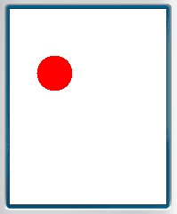

<a href="https://youtu.be/watch?v=TrSiYEIkNnY&t=26s" target="_blank"><h1>Games are made of Frames</h1></a>

---

# Frames are made of images

Drawing frames continuously creates an animation.

<table>
  <tr>
    <td rowspan="2"></td>
    <td>FPS = 10 Hz</td>
  </tr>
  <tr><td>Δt = 0.1 s</td></tr>
  <tr>
    <td rowspan="2"></td>
    <td>FPS = 20 Hz</td>
  </tr>
  <tr><td>Δt = 0.05 s</td></tr>
</table>

---

<a href="https://youtu.be/watch?v=TrSiYEIkNnY&t=200s" target="_blank"><h1>How to draw a frame?</h1></a>

---

# Using Canvas

Canvas APIs help you draw graphics, while abstracting away the hardware details.

Examples:

- `<canvas>` in HTML <a href="https://developer.mozilla.org/en-US/docs/Web/API/Canvas_API/Tutorial/Basic_usage" target="_blank">↗️</a>

- `Canvas` in Android <a href="https://developer.android.com/reference/android/graphics/Canvas" target="_blank">↗️</a>

---

# Using Canvas in J2ME

- <a href="https://nikita36078.github.io/J2ME_Docs/docs/midp-2.0/javax/microedition/lcdui/Canvas.html" target="_blank"><code>javax.microedition.lcdui.Canvas</code></a>

  Provides APIs for drawing graphics and handling input events

- <a href="https://nikita36078.github.io/J2ME_Docs/docs/midp-2.0/javax/microedition/lcdui/game/GameCanvas.html" target="_blank"><code>javax.microedition.lcdui.game.GameCanvas</code></a>

  Extends the Canvas APIs with an off-screen graphics buffer and multi-key input handling

---

<a href="https://youtu.be/watch?v=TrSiYEIkNnY&t=338s" target="_blank"><h1>Code Demo</h1></a>

## ⚡⚡⚡

---

# Steps

1. Setup a new gradle project
2. Add entrypoint extending `MIDlet` class
3. Create a custom `Canvas` instance
    - Override `paint` method and draw
4. Display this canvas

---

# Result

_Just a red ball on white canvas_

---

<a href="/" target="_blank"><h1>The End</h1></a>

_💟 Thanks for giving your time!_
