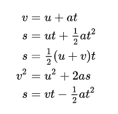
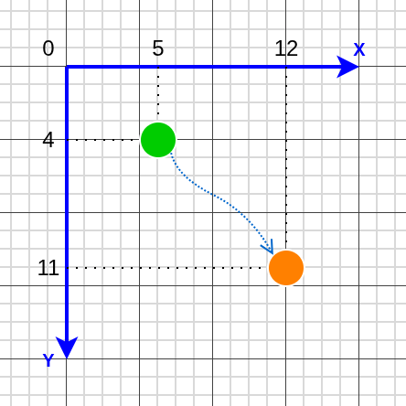
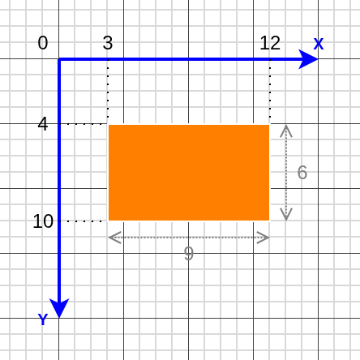

<a href="https://www.youtube.com/watch?v=qvXKyaDz6Ow&t=17s" target="_blank"><h1>Introduction to Game Physics</h1></a>

<video src="bouncing-ball.webm" autoplay loop muted playsinline>
  <i>This browser does not support WebM videos. 
  Please <a href="bouncing-ball.webm" target="_blank">download it</a> and open in a media player.</i>
</video>

---

# What is Game Physics?

The simulation of physical phenomena within a video game environment.

- Gravity and motion
- Collision detection
- Fluid simulation
- Particle effects


---

# Equations of motion

Mathematical functions describing the behavior of a physical system 
in terms of dynamic variables like position and time.

<a href="https://en.wikipedia.org/wiki/Equations_of_motion" target="_blank">
  <p></p>
</a>

---

<a href="https://www.youtube.com/watch?v=qvXKyaDz6Ow&t=160s" target="_blank"><h1>2D in J2ME</h1></a>

Important conventions of `Graphics` API <a href="https://nikita36078.github.io/J2ME_Docs/docs/midp-2.0/javax/microedition/lcdui/Graphics.html" target="_blank">↗️</a>
 
- X-axis is towards right
- Y-axis is towards bottom
- Origin is at top-left corner

---

# 2D motion



<style>
pre {
  background-color: #000;
}
</style>

```java
class Ball {
    void move(float t) {
        x = ux*t + ax*t*t/2;
        y = uy*t + ay*t*t/2;
    }
    // ...
}

while (isRunning) {
    ball.move(timePerFrame());
}
```

---

# 2D shapes



<style>
pre {
  background-color: #000;
}
</style>

```java
void drawBox(Graphics g) {
    g.setColor(0xff8000);
    // (hexadecimal)
    
    g.fillRect(3, 4, 9, 6);
    // (xStart, yStart, width, height) 
}
```

---

<a href="https://www.youtube.com/watch?v=qvXKyaDz6Ow&t=362s" target="_blank"><h1>Code Demo</h1></a>

## ⚡⚡⚡

---

# Steps

1. Design the core game loop
2. Extend `GameCanvas` class:
   - Add physics for ball movement
   - Draw ball using `Graphics`
3. Start game loop in background thread

---

<a href="/" target="_blank"><h1>The End</h1></a>

_💟 Thanks for giving your time!_
